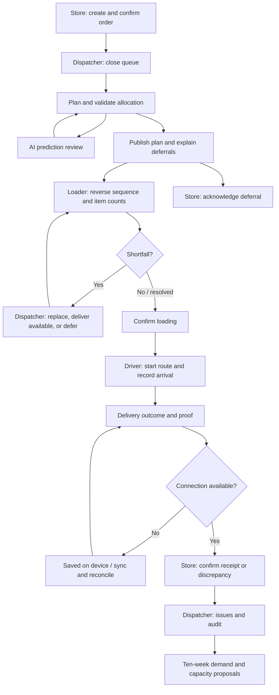

# Frontend workflow and failure scenarios

Reference: **Challenge Booklet**, Waypoint Group, pages 3–9, 12, and 15–20. The booklet informs domain requirements; competition submissions, model training, and deployment are separate tasks.

## What this implementation covers

The responsive React frontend connects store ordering, dispatcher planning, warehouse loading, driver delivery and store receipt through one persisted browser operation. It now includes a workflow dashboard, a dispatcher prediction review queue, ten-week demand views for both depots and all three brands, capacity proposals, and role-aware recovery screens.

This remains a frontend prototype. Seeded geography and demand are illustrative, not imported competition CSVs. Browser storage is shared between tabs on the same origin, not between separate computers. There is no production API, authentication boundary, trained model, live traffic feed, rental booking, or statistical accuracy claim. Existing native Flutter screens are not changed by this frontend work.

## People and priorities

| Role | Working conditions | Priority |
| --- | --- | --- |
| Dispatcher | Large planning-office screen; coordinates the shared fleet | Explain allocation and deferrals, review risks, publish valid routes, recover exceptions. |
| Loader | Shared warehouse tablet; limited time at the dock | Load in reverse stop order, count accurately, report shortfalls before departure. |
| Driver | Personal phone; intermittent rural/hill-country coverage | Use the next stop while safely stopped, record outcomes and proof offline, reconcile changes. |
| Store manager | Counter desktop or phone; receiving staff need notice | Confirm orders, understand arrival estimates and rescheduling, confirm quantities and condition. |

## Connected screen flow

**Full workflow** (`/workflow`) is available to every signed-in role. It shows seven handoffs and progress scoped to the current delivery date and role. Only the owning role gets an action link; the remaining steps identify who acts next. It does not automatically complete operational work. Use the demo role switcher or separate signed-in tabs to demonstrate cross-role handoffs.

## Numbered judge walkthrough

1. Start `web` with `npm install` and `npm run dev`. Open `/login`. Each demo button signs into a seeded role; email/password accounts are in the root README. For a reproducible fresh run, use **Demo → Reset demo data**. Reset only when you intend to discard the current browser demo.
2. As **Store manager**, open **Full workflow**, then **Create order**. Add items and confirm. The countdown uses the Sri Lanka 16:00 cutoff. Late orders go to the following operating run; Sunday is skipped. Seeded orders already provide a complete allocation day if a newly created late order belongs to a later run.
3. In another tab, sign in as **Dispatcher**. Open **Orders**, close the queue, and generate a plan in **Planning**. Inspect a hard-constraint failure if desired; vehicle access, refrigeration, weight, volume, fuel and timing remain authoritative.
4. Open **AI predictions**. Filter by order/outlet, **Needs review**, or **Awaiting allocation**. Open **Review estimate**, inspect factors and ranges, write a rationale, and save. The review enters the order's audit timeline. If a change is needed, use **Adjust allocation** or **Inspect route**; saving a review alone does not change a route.
5. Return to **Planning**, review proposed deferrals, and publish. **Routes** shows the released stops; stores receive scheduling/rescheduling notices. For the seeded cross-role story, use **VEH014** and store **OUT032** where available in the plan.
6. Sign in as **Loader**. Open the released trip for **VEH014**, click **Start loading**, then count items in the displayed reverse stop sequence. Confirm each stop. For an exception, report a missing item: the final load action stays blocked until a dispatcher records a shortfall decision in **Issues**. Return and complete loading.
7. Sign in as **Driver**. Open **Today**, start the loaded route, and open the next stop. The delivery outlook shows handling duration and arrival range; these are advisory demo estimates. Record arrival, select the outcome, confirm items, enter a receiver and capture a photo or signature, then complete delivery. Do this only while safely stopped.
8. To demonstrate offline operation, first open **Service & recovery** and **Simulate connection loss**. Continue a driver delivery or loader count. The update remains on the device. Inspect **Sync**, then use **Reconnect demo device** on the recovery page. Confirm that synchronization completes. Do not clear browser data while unsynchronized work exists.
9. To demonstrate failed proof upload, enable **Simulate proof upload failure**, capture a photo and finish the delivery. **Sync** identifies the failed proof update separately. **Retry failed updates** restores uploads in the demo and retries the same update; it does not require delivering again.
10. Back as **Store manager**, inspect the delivery at `/store` or **Deliveries → order details**. Confirm received quantities, condition and receiver. A discrepancy raises a shared issue. A deferred order instead offers its explanation and acknowledgement.
11. As **Dispatcher**, review **Issues** and **History & audit**. Prediction reviews are recorded under the order, scenario changes under `PREDICTIONS`, and capacity requests under `CAPACITY`.
12. Open **Capacity forecast**. Select either depot and any brand. Inspect all ten ISO weeks in chart or table view, adjust the demand scenario, select a week, and save a proposal with additional vehicle/driver count, temperature capability and a reason. The saved request is a proposal, not an actual rental booking or fleet allocation.
13. Open **Service & recovery**, choose **Low confidence**, **Inputs out of date**, or **Predictions unavailable**. Revisit the prediction list and driver/store outlook: uncertainty widens for low confidence, while stale/unavailable/offline modes remove late percentages and show planning allowances. **Restore demo estimates** returns the scenario to normal; use the browser demo connection control separately for offline mode.

## Screens and rationale

### Dispatcher

- **Overview** (`/dispatcher`) summarizes fleet/work progress and provides direct entry to the full workflow, predictions and recovery. Urgent work is reachable before opening individual records.
- **Orders** (`/dispatcher/orders`) collects demand into the cutoff queue and distinguishes confirmed, scheduled and deferred work, so planning is based on an explicit shared set of orders.
- **Planning** (`/dispatcher/planning`) provides allocation, validation and publication. Hard constraints prevent a reassuring prediction from making an infeasible trip acceptable.
- **Routes and route detail** (`/dispatcher/routes`, `/dispatcher/routes/:tripId`) expose vehicle, sequence and timing so a dispatcher can connect a flagged prediction to a concrete route decision.
- **Vehicles and vehicle detail** (`/dispatcher/vehicles`, `/dispatcher/vehicles/:id`) show capacity, capability, depot and availability. A compatible vehicle is necessary for safe allocation and breakdown recovery.
- **Outlets** (`/dispatcher/outlets`) make receiving windows and access restrictions visible at planning time rather than on arrival.
- **Live operations** (`/dispatcher/live`) brings route progress and exceptions together. Locations and timelines in this prototype are demo/saved state, not a real tracking feed.
- **Issues and issue detail** (`/dispatcher/issues`, `/dispatcher/issues/:id`) connect shortfalls and breakdowns to affected orders and recovery actions. The outcome reaches field users and store managers.
- **Deferred orders** (`/dispatcher/deferred`) keep the reason, customer explanation and repeated-deferral context together. An order is not silently dropped because capacity ran out.
- **AI predictions** (`/dispatcher/predictions`) show handling ranges, planned arrival, illustrative late likelihood, explanatory factors and review history. The queue excludes completed deliveries and focuses on the selected operating run.
- **Capacity forecast** (`/dispatcher/capacity`) supports all six depot/brand combinations across ten ISO weeks. Total volume includes chilled volume; Style and Tech have no chilled demand. Fleet comparisons are assumptions, and requests remain proposals.
- **What-if simulator** (`/dispatcher/simulator`) allows a dispatcher to inspect constraint consequences before altering the real operation. It complements, rather than replaces, the forward-demand view.
- **History & audit** (`/dispatcher/history`) retains operational decisions and their actor. The default filter includes capacity and prediction entities as well as orders.

### Loader

- **Today** (`/loader`) prioritizes released and in-progress trips and links to the cross-role flow, reducing reliance on obsolete printed lists.
- **Trips** (`/loader/trips`) distinguishes work waiting at the dock from completed loads.
- **Load** (`/loader/load/:tripId`) presents reverse stop sequence, item counts and shortfalls. Both the UI and event reducer block loading completion while a reported shortfall has no decision, and block route start before loading is complete.
- **Issues** (`/loader/issues`) communicates dock exceptions and dispatcher responses without requiring the loader to guess what can leave.
- **History** (`/loader/history`) gives the shared terminal a record of completed dock work.
- **Sync** (`/loader/sync`) shows saved counts/updates and retries. The loader can continue recording locally through a connection failure.

### Driver

- **Today** (`/driver`) gives an assigned vehicle, route readiness and the next action. A route cannot start from a draft or partially loaded state.
- **Route** (`/driver/route`) keeps stop order, progress and receiving context accessible on a phone.
- **Stop** (`/driver/stop/:orderId`) combines arrival, delivery outlook, outcome, receiver and proof. Prediction factors remain visible without replacing delivery evidence.
- **Issues** (`/driver/issues`) provides a safe stopped-vehicle path to report breakdown or refrigeration failure and await recovery instructions.
- **Sync** (`/driver/sync`) separates saved work from failed uploads and retains recorded delivery outcomes while proof is retried.
- **History** (`/driver/history`) lets the driver verify completed or failed attempts after the route changes.

### Store manager

- **Overview** (`/store`) focuses on the delivery or deferral requiring attention, with the advisory arrival/handling outlook alongside shared order progress.
- **Orders and detail** (`/store/orders`, `/store/orders/:id`) provide confirmation, status and evidence for the store's own orders.
- **Create order** (`/store/orders/new`) exposes quantities, volume and the cutoff before submission; operating dates follow Sri Lanka time and skip Sunday.
- **Deliveries** (`/store/deliveries`) gives receiving staff an entry point from scheduled transport to receipt confirmation.
- **Issues** (`/store/issues`) lets discrepancies enter the same dispatcher exception workflow instead of becoming a separate phone conversation.
- **History** (`/store/history`) preserves previous ordering and receiving outcomes.

### Shared

- **Service & recovery** (`/resilience`) explains each failure's impact, preserved information and recovery action, with role-appropriate links. The reversible scenario controls are explicitly marked as demo controls.
- **Offline office/store workspace** replaces mutable screens when disconnected. Saved orders stay visible, while planning and receipt mutations wait for a connection; only driver/loader events implement offline replay.
- **Profile** (`/profile`) supports account/theme context, while the navigation, notifications and footer remain consistent across roles.

## Fully developed degradation scenarios

**Connection lost on the Kandy corridor.** Field users need to preserve work through unreliable coverage. Driver and loader screens retain the route/count context, save field events locally, expose pending/failed counts in Sync, and reconcile on reconnect. Office/store users instead get a read-only saved-order screen because their commands do not have an offline replay contract. Demo connectivity is per session; real connectivity uses browser online/offline events.

**Predictions cannot be trusted.** The prediction layer can be low confidence, stale or unavailable even when the application is online. Low confidence widens demo ranges and requires review. Stale/unavailable modes hide late likelihoods, label fixed planning allowances, and keep hard constraints in force. A shared banner leads every role to the recovery explanation. Restoring the demo scenario is explicit and audited.

**Proof upload failed or route changed offline.** A completed stop must not be lost or repeated because a file transfer failed. The outbox preserves the delivery event and exposes proof retry; the existing route-conflict sheet explains reassignment while keeping deliveries already recorded offline. The scenario controls let reviewers exercise this without changing browser network settings.

**Loading shortfall or vehicle failure.** Missing inventory and lost cold-chain capability change what can safely be delivered. The loader's completion action is blocked pending a shortfall decision. A driver can report failure, the dispatcher reviews compatible recovery/deferral choices, and stores see the resulting explanation. Recovery never treats an advisory prediction as permission to violate a vehicle constraint.

## Prediction and forecast contract

`src/domain/intelligence.ts` is the adapter boundary for future model output. The current handling estimate uses the order's volume and explicit mall/fragile/chilled handling allowances; arrival comes from the saved planning schedule. Late likelihood is an illustrative score relative to arrival after the window closes, separate from waiting and unloading. No actual delivery outcomes are used as prediction inputs. The demo score is not calibrated and must be replaced before production use.

Demand counts unique requested orders, including deferred ones, by depot and brand. The illustrative cadence is six Fresh delivery days, one Style weekly cycle and three Tech demand days, multiplied by the selected scenario. Ten Monday-start ISO periods handle year boundaries. Zero-demand cohorts stay zero. The fleet comparison assumes one trip per day, six days, at 85% volume utilization; it does not promise feasible allocation because weight, windows, fuel, access and competing brands still apply.

`OpsData.intelligence` is optional for compatibility with saved demos created before this update. Reviews, scenario changes and capacity proposals use the existing operation store and audit trail, so other role tabs see the same state.

## Verification

- `cd web && npm test` runs domain/flow tests with the existing TypeScript compiler and Node's test runner. Use Node 22.15+ (24 recommended) for the loader hooks.
- `npm run build` type-checks and creates the production/PWA bundle.
- Browser checks exercise prediction review, stale/unavailable fallback, restoration, capacity proposal creation, and role-specific workflow/recovery screens at desktop and 390px phone width.
- Model training, competition CSV validation, a backend/database, Docker deployment and real multi-device synchronization remain separate implementation work.
